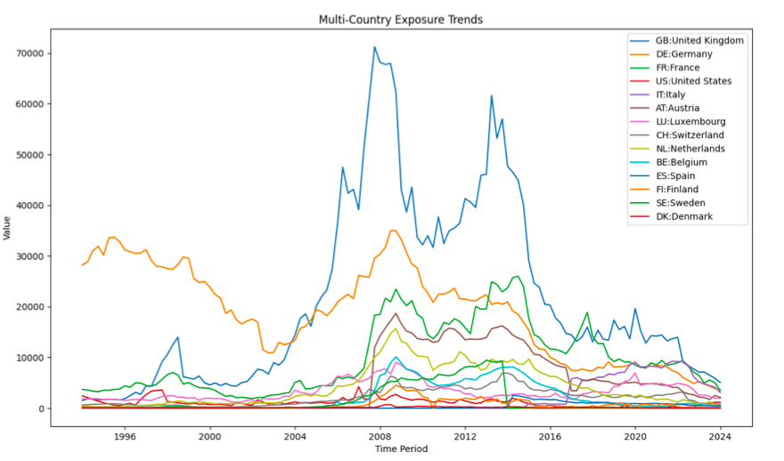

# 🧠 Jupyter Notebook Summary: Exposure Analysis Visualisation

This document presents a reconstruction of the visualisation process used during the data analysis phase of my master’s thesis. While the dataset is no longer available, the following code snippets and images showcase the key Python visualisations produced from the original BIS data.

---

## 📌 1. Pie Chart – Total Exposure by Country

This plot visualises the total accumulated cross-border claims by reporting country.


```python
import pandas as pd
import matplotlib.pyplot as plt

data = pd.read_excel('Converted data.xlsx')
total_exposure_by_country = data.groupby('Reporting_Country')['Value'].sum()

plt.figure(figsize=(10, 7))
plt.pie(total_exposure_by_country, labels=total_exposure_by_country.index, autopct='%1.1f%%')
plt.title('Total Exposure by Country')
plt.show()




