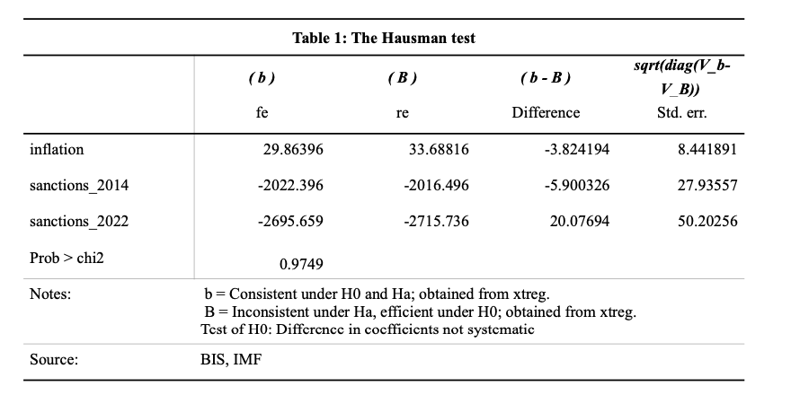
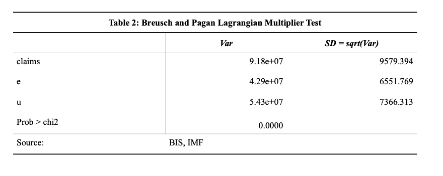
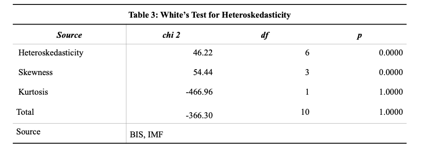
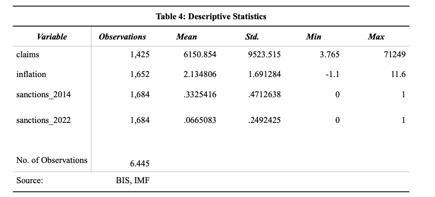
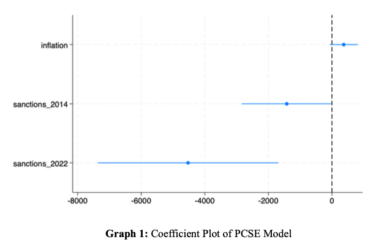

# 📘 Stata Regression Analysis Summary: Panel Data (1993–2023)

This document summarises the econometric analysis performed in **Stata 17** as part of my master’s thesis. The focus was to assess how economic sanctions in 2014 and 2022 affected the cross-border banking exposure of 14 Western countries to Russia, using quarterly panel data from 1993 to 2023.

---

## 🧩 Dataset Structure

- **Panel ID**: `country`
- **Time Variable**: `date` (quarterly)
- **Dependent Variable**: `claims` – Cross-border claims on Russian banks (USD millions)
- **Key Explanatory Variables**:
  - `sanctions_2014`: Dummy variable (1 from 2014 Q1 onwards)
  - `sanctions_2022`: Dummy variable (1 from 2022 Q1 onwards)
  - `inflation`: Country-level inflation rate (control)

---

## 🧪 Modelling Approach

1. **Pooled OLS**
   ```stata
   reg claims inflation sanctions_2014 sanctions_2022

---

## 📊 Diagnostic Tests and Model Results

### 📌 Table 1: Hausman Test – FE vs RE

This test was used to compare fixed effects and random effects estimators.  
The result showed no significant difference → RE preferred.



---

### 📌 Table 2: Breusch-Pagan LM Test – RE vs Pooled OLS

This test checked for panel effects.  
Significant result (Prob > chi2 = 0.0000) → Random effects justified.



---

### 📌 Table 3: White’s Test for Heteroskedasticity

The test indicated heteroskedasticity (p < 0.05), confirming the need for robust standard errors.



---

### 📌 Table 4: Descriptive Statistics

Summary stats for the main variables in the panel model.



---

### 📈 Graph 1: PCSE Model Coefficient Plot

Final PCSE model results showing effect sizes and confidence intervals.



> Interpretation:  
> Sanctions in **2022** significantly reduced cross-border claims by ~4,526 units.  
> Inflation and 2014 sanctions were not statistically significant at the 5% level.

